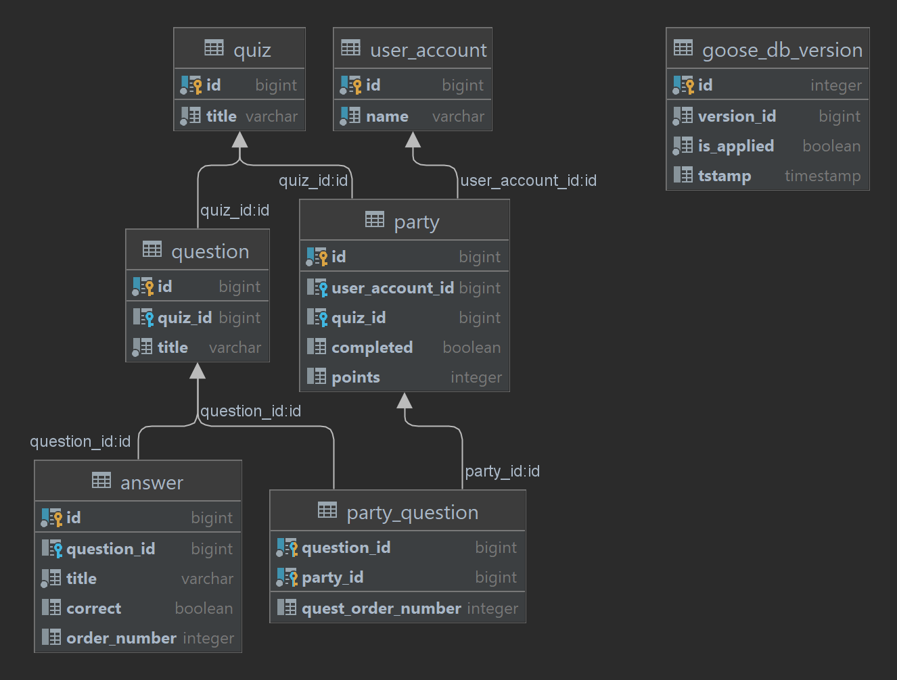

# README в не очень актуальном состоянии, произошло немного изменений: тгбот переехал в эту репу, он перешел для хранения сессий на редисе, произошел некоторый рефакторинг конфигов и кода в целом.

## QUIZ BOT SERVICE

gRPC-cервис, который позволяет проходить квизы на технические темы. Тут должна появиться ссылка на telegram-бота, который будет фронтом к нему.

Есть веб-морда в виде [telegram-бота.](https://github.com/dimayasha7123/quiz_service/tg_client)

Севрис имеет gRPC ручки, а также http-proxy к ним.

Сервис использует [quizapi](https://quizapi.io/). Данный API, к сожалению, не позволяет получать конкретные вопросы, но он может предоставить пак рандомных вопросов по тегу или по категории. Вопросы сохраняются в базу сервиса, чтобы в конце концов их украсть и не ходить туда больше, ибо долго (около 300-400 мс).

Созданный сервис позволяет:
1. Добавить пользователя в сервис (подробнее об упрощенной аутентификации ниже)
2. Получить список квизов
3. Запустить квиз-пати (принять участие в квизе, будет создана сессия и отправлены вопросы с вариантами ответов)
4. Отправить ответы (по id квиз-пати) и получить отчет по прохождению и место в рейтинге
5. Получить топ по квизу и свой рейтинг в нем
6. Просто получить топ по квизу (без привязки к пользователю)

Приличный сервис должен иметь хотя бы "упрощенную" систему авторизации/аутентификации. Поэтому было решено добавлять пользователя по некому токену, который сам пользователь присылает, а в ответ отправлять ему внутрнний id этого пользователя в сервисе. Дальнейшие доступ происходил по этому id. Соответственно, не может быть двух пользователей с одинаковыми токенами. Как и возможности восстановить доступ к аккаунту пользователя, ибо этого не предусмотрено. Увы.

### Запуск

Сервис считывает параметры для запуска из переменных среды, или же (если не нашел в переменных) из файла .env, который можно дать при помощи флага --env

#### При помощи make-файла:

```
make init_postgres
make goose_up
make start
```

#### При помощи docker compose:

```
docker compose up
```

### Схемка базы



### p.s. - рефлексия по поводу

Это был первый микросервис который я написал (а также первый серьезный проект на Go), возможно слишком он слишком монолитный). Можно распилить на несколько сервисов, например, с пользователями, квизами, рейтингом. Последний особенно нужен, ибо сейчас все результаты хранятся в реляционном виде в postgres, и запрос там монструозный на вытаскивание рейтинга, что не круто, но на первый раз пойдет.

Пытался в серьезную разработку (тут должен быть мем с котятками, которые играют в сеньер разрабов). Вроде похоже на Clean Architecture (далеко не полностью), жаль про TDD поздно узнал, поэтому тесты на ручки есть, но довольно посредственные и не везде.

Долго изучал и тыкался в Docker. Было весело. Инструмент полезный, но сложно по началу, как-то завернул в Compose, но не уверен, что все правильно сделано, например, долго разбирался с конфигом, решил в итоге, что пусть он лежит в .env файле, пока хватит.

TODO:
    gracefull shutdown
