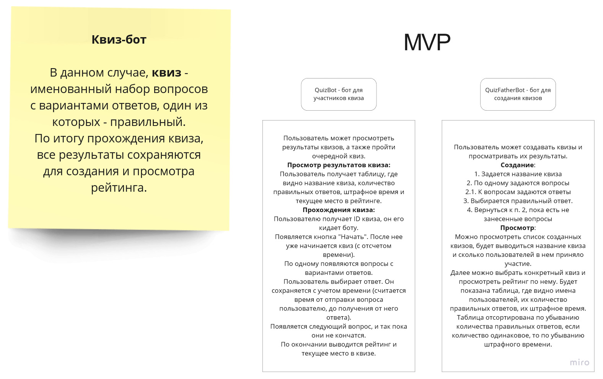
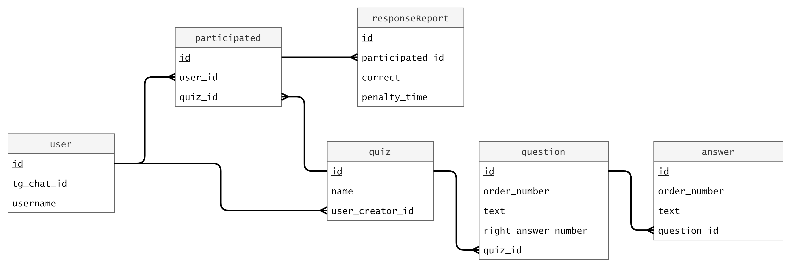

# homework-2

## Все плохо, поэтому начну заново

От предыдущей идеи отказался, ибо сложно туда фич добавить. Парсер он и есть парсер. Была идея хранить копию расписания всего универа у себя локально. Это, кстати, даже имеет смысл, ибо сервер универа часто лежит и отдыхает, особенно по ночам.

Плюс ко всему есть проблемы с парсингом, но это уже не важно.

## Новая надежда

Сириус в качестве возможной темы проекта привел "Бот Что-Где-Когда?"

Моя идея слегка шире - Квиз Бот. Подробнее ниже.

## Схема БД

Накидал примерную схему базы данных, которая описывает MVP.

