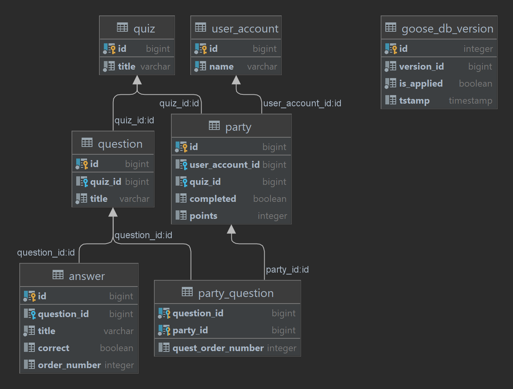

## QUIZ_BOT_SERVICE  (homework-2)

Квиз-бот [tg_quiz_bot](https://gitlab.ozon.dev/dimayasha7123/homework-2-dimayasha7123-botclient), а также сервис, который позволяет проходить квизы на технические темы.

Сервис использует [quizapi](https://quizapi.io/). Данный API, к сожалению, не позволяет получать конкретные вопросы, но он может предоставить пак рандомных вопросов по тегу или по категории. Чем я и воспользовался. А чтобы было веселее, я решил сохранять вопросы себе в базу.

Созданный сервис позволяет:
1. Добавить пользователя в сервис (об этом подробнее ниже)
2. Получить список квизов
3. Запустить квиз-пати (принять участие в квизе, будет создана сессия и отправлены вопросы с вариантами ответов)
4. Отправить ответы (по id квиз-пати) и получить отчет по прохождению и место в рейтинге
5. Получить топ по квизу и свой рейтинг в нем
6. Просто получить топ по квизу (без привязки к пользователю)

В слаке обсуждалось, что сервис должен иметь хотя бы "упрощенную" систему авторизации/аутентификации. Поэтому было решено добавлять пользователя по некому токену, который сам пользователь присылает, а в ответ отправлять ему внутрнний id этого пользователя в сервисе. Дальнейшие доступ происходил по этому id. Соответственно, не может быть двух пользователей с одинаковыми токенами. Как и возможности восстановить доступ к аккаунту пользователя, ибо этого не предусмотрено. Увы.

